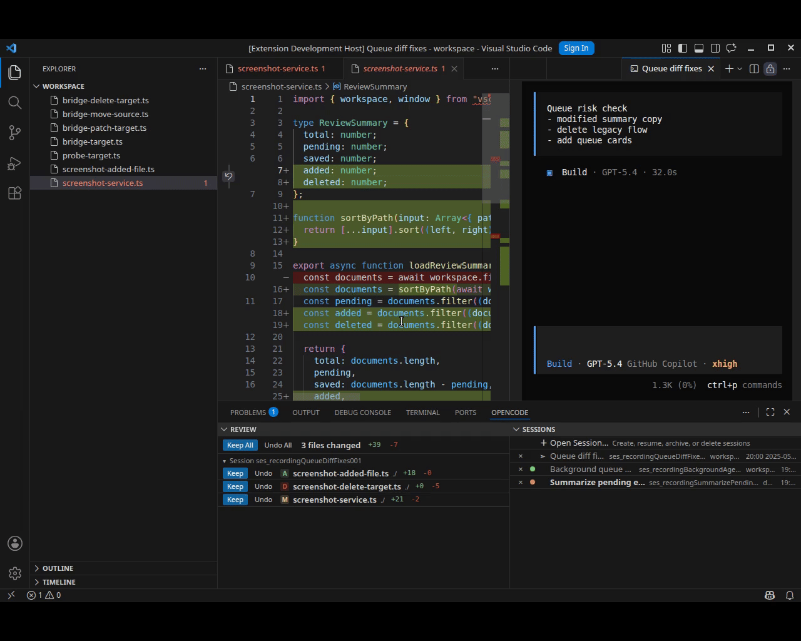

# OpenCode TUI Integration



Manage OpenCode TUI sessions inside VS Code, watch their state, get desktop notifications when attention is needed, and review changed files with `Keep` or `Undo`.

## Features

| Feature | Description |
| --- | --- |
| Session management | Browse, resume, fork, archive, and delete OpenCode TUI sessions from VS Code. |
| Session status | See the current session list and status such as ready, running, finished, permission required, and unread attention. |
| Desktop notifications | Get notified when a session finishes, waits for permission, or reports an error, even while working outside VS Code. |
| Diff review with `Keep` / `Undo` | Open changed files in the native VS Code diff view and decide which edits to keep or discard. |

## Requirements

- `opencode` must be installed and available on `PATH`.
- Use a local writable workspace in desktop VS Code.
- Pre-release extension.
- Verified primarily on Linux, with GitHub Actions used for release validation on macOS and Windows.

## Quick Start

1. Install the extension from a GitHub release `.vsix`.
2. Open a local workspace.
3. Use the `OPENCODE` panel at the bottom of VS Code to start or resume a session.
4. Watch session status there and review file changes with `Keep` or `Undo`.

## Build From Source

Generate a local `.vsix` package from the repository root:

```bash
npm ci
npm run check-types
npm test
npm run package
```

This produces `opencode-tui-integration-*.vsix` in the project root.

Use that file with `Extensions: Install from VSIX...` in VS Code.

## For Developers

### Verify locally

- Run these commands from the repository root (`opencode-tui-integration/`).
- `npm test` runs the unit test suite.
- `npm run test:integration` runs the VS Code integration tests.
- `npm run verify` runs type checks, tests, integration tests, and packaging checks.

## License

This repository's source code is licensed under MIT. The packaged extension also includes third-party notification binaries that keep their own licenses. See `LICENSE` for details.

Contributions are welcome.
